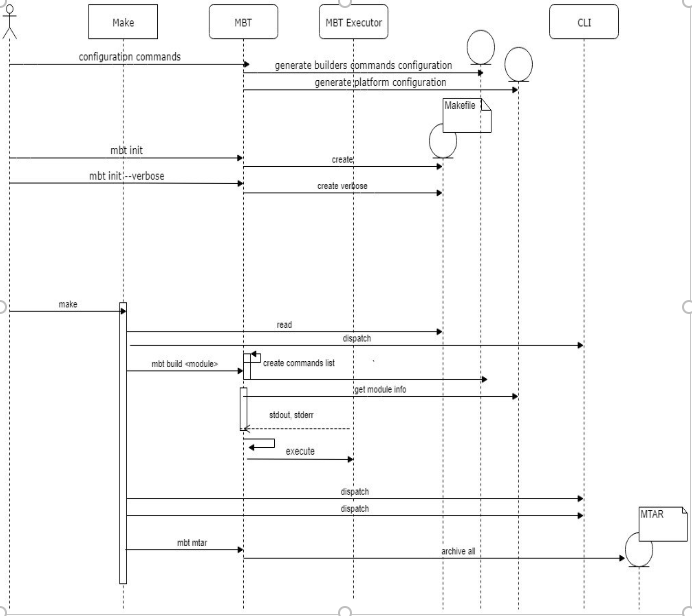

#Cloud MTA build tool HLD

 
#### The new MTA archive builder tool will use a new approach for building a project. 

 
The MTA archive builder is a command-line tool that developers can install and extend as they require; 
We provide some default commands that users can extend to support their needs as part of the entire MTA build process. 

The new tool will analyze the development descriptor and build a Makefile that describes the build process steps,
In this way, by merely using a command such as `mbt init`, all the build process steps are generated as a manifest 
file that describes the build flow step by step and users will be able to modify it according to their needs or use it out-of-the-box. 

 
#### The Cloud MTA build tool providing smaller pieces of the MTA build process such as:  

building an `.mtar` file from a given project, creating a` META-INF` folder with corresponding deployment information such as `.mtad` and `manifest.mf` files. 

In this approach we are providing the following features: 

-  Transparency – Users can see what is done under the hood during their project build processes. Users can interfere with the build process and adapt it to their own needs, such as adjustable pipeline requirement. For example, we are providing a default script (Makefile) to run based on the development descriptor, and users can add or remove commands as needed. 

- Extendable – Users can extend the tool with new build capabilities that are not provided out-of-the-box by the configuration file.
Page Break
 

New MTA Archive Builder Generation Flow 

  
 

 

 

 
