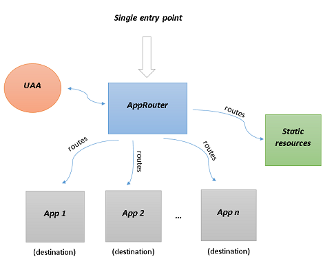

@sap/approuter
==============

<!-- toc -->

- [Overview](#overview)
- [Deploying a business application with microservices](#deploying-a-business-application-with-microservices)
- [Working directory](#working-directory)
- [Configurations](#configurations)
  * [Destinations](#destinations)
    + [Environment-destinations](#environment-destinations)
    + [Destination-service](#destination-service)
  * [UAA configuration](#uaa-configuration)
  * [Additional headers configuration](#additional-headers-configuration)
  * [Plugins configuration](#plugins-configuration)
  * [Session timeout](#session-timeout)
  * [X-Frame-Options configuration](#x-frame-options-configuration)
  * [Cross-Origin](#cross-origin)
- [Routes](#routes)
  * [Example routes](#example-routes)
- [Replacements](#replacements)
- [*xs-app.json* configuration file](#xs-appjson-configuration-file)
  * [*welcomeFile* property](#welcomefile-property)
  * [*authenticationMethod* property](#authenticationmethod-property)
  * [*routes* property](#routes-property)
  * [*login* property](#login-property)
  * [*logout* property](#logout-property)
  * [*destinations* property](#destinations-property)
  * [*compression* property](#compression-property)
  * [*pluginMetadataEndpoint* property](#pluginmetadataendpoint-property)
  * [*whitelistService* property](#whitelistservice-property)
  * [*websockets* property](#websockets-property)
  * [*errorPage* property](#errorpage-property)
  * [Complete example of an *xs-app.json* configuration file:](#complete-example-of-an-xs-appjson-configuration-file)
- [Headers](#headers)
  * [Forwarding Headers](#forwarding-headers)
  * [Hop-by-hop Headers](#hop-by-hop-headers)
  * [Custom Headers](#custom-headers)
- [CSRF Protection](#csrf-protection)
- [Connectivity](#connectivity)
- [SaaS Application Registration in CF](#saas-application-registration-in-cloud-foundry)
  * [How To Expose Approuter for SaaS Subscription](#how-to-expose-approuter-for-saas-subscription)
- [Web Sockets](#web-sockets)
- [Session Handling](#session-handling)
  * [Session Contents](#session-contents)
- [Central Logout](#central-logout)
- [Whitelist Service](#whitelist-service)
  * [Enable the service](#enable-the-service)
  * [Configuring allowed hostnames / domains](#configuring-allowed-hostnames--domains)
  * [Return value](#return-value)
- [Scaling](#scaling)
- [Sizing Guide for Application Router](#sizing-guide-for-application-router)
- [Configure server-side HTTPS](#configure-server-side-https)
- [Audit-Log Service](#audit-log-service)
- [Troubleshooting](#troubleshooting)
- [Extending Application Router](#extending-application-router)
- [Best practices](#best-practices)
  * [Security best practices](#security-best-practices)
    + [Content-Security-Policy](#content-security-policy)

<!-- tocstop -->

## Overview

When a business application consists of several different apps (microservices),
the application router is used to provide a single entry point to that business application.
It has the responsibility to:

* Dispatch requests to backend microservices (reverse proxy)
* Authenticate users
* Serve static content





Let's think of the different apps (microservices) as _destinations_ to which the incoming request will be forwarded.
The rules that determine which request should be forwarded to which destination are called _routes_.
For every destination there can be more than one route. You may read more on the concept of [routes](#routes) later in this document.
If the backend microservices require authentication, the application router can be configured to authenticate the users and propagate the user information.
Again by using routes, the application router can serve static content.

The application router is designed to work in XS Advanced - Cloud Foundry and XS OnPremise Runtime.

A calling component accesses a target service by means of the application router only if there is no JWT token available, for example, 
if a user invokes the application from a Web browser.
If a JWT token is already available, for example, because the user has already been authenticated, or the calling component uses a JWT token for its own OAuth client,
the calling component calls the target service directly; it does not need to use the application router.

**Note** that the application router does not hide the backend microservices in any way. They are still directly accessible bypassing the application router. So the backend microservices _must_ protect all their endpoints by validating the JWT token and implementing proper scope checks. Network isolation is not provided currently by the platform.

## Deploying a business application with microservices

For example we can have a business application that has the following structure:

<pre>
+-- manifest.yml
+-- manifest-op.yml
|  +-- microservice-1
|  | +-- ...
|  | +-- ...
|  +-- microservice-2
|  | +-- ...
|  | +-- ...
|  +-- web
|  | +-- ...
|  | +-- ...
</pre>

The *manifest.yml* file is used to deploy the business application on Cloud Foundry and the *manifest-op.yml* - on the XS OnPremise Runtime.
These files should describe all the microservices for that business application.

Folders are used to isolate the different microservices. Let's assume that the application router is the microservice in the *web* folder (every business application has its own application router).
Here is how we can include the application router:

* Manually create the *node_modules* folder in the *web* folder.
* Copy and paste the folder that contains the self-contained application router into *node_modules*. In this example the name of that folder is *@sap/approuter*, see the *start* script in the *package.json* below.
* Check the version of the application router you just copied.
* Create a *package.json* file in *web* with content similar to the following and replace the version's value with the version of your application router:

```json
{
    "name": "hello-world-approuter",
    "dependencies": {
       "@sap/approuter": "2.6.1"
    },
    "scripts": {
        "start": "node node_modules/@sap/approuter/approuter.js"
    }
}
```

In order to use the application router you don't have to write any JavaScript code.
Only some configurations have to be provided in the *web* folder. Here is a complete example:

<pre>
+-- web
| +-- package.json
| +-- xs-app.json
| +-- resources
| | +-- hello-world.html
| | +-- my-page.html
| +-- node_modules
| |   +-- ...
| +-- default-env.json
| +-- default-services.json
</pre>

The *web* folder contains the *package.json*, *node_modules*, some configuration files used by the application router, and static resources to be served.
You can read more about the [configurations](#configurations) later in this document.

By default, the application router runs on port 5000 (if started locally) or it takes the port from the `PORT` environment variable.

## Working directory

The working directory contains configuration files that the application router needs and static resources that can be served at runtime.
In the [previous example](#deploying-a-business-application-with-microservices), the *web* folder is the working directory.
By default the current directory is the working directory.
It is possible to configure it during start up of the application router with the following command line argument:

```bash
node approuter.js -w <working-dir>
```

Application router will abort if the working directory does not contain *xs-app.json* file.

## Configurations

The application router makes use of the following configurations:

- [Main configuration](#xs-appjson-configuration-file) - this is the *xs-app.json* file. This file is mandatory and contains the main configurations of the application router.

- [UAA configuration](#uaa-configuration) - the application router reads this configuration either from the `VCAP_SERVICES` environment variable (when deployed on Cloud Foundry or XS Advanced OnPremise Runtime)
or from the *default-services.json* file (when running locally). Refer to the documentation of the `@sap/xsenv` package for more details.

- Configurations from the environment - these configurations are either read from the application router's environment (when deployed on Cloud Foundry or XS Advanced OnPremise Runtime)
or from the *default-env.json* file (when running locally). Refer to the documentation of the `@sap/xsenv` package for more details.
The environment variables that the application router takes into account are:


Configuration | Environment variable | Description
------------- | -------------------- | ------------
[UAA service name](#uaa-configuration) | `UAA_SERVICE_NAME` | Contains the name of the UAA service to be used.
[Destinations](#destinations) | `destinations` | Provides information about the available destinations.
[Additional headers](#additional-headers-configuration) | `httpHeaders` | Provides headers that the application router will return to the client in its responses.
[Plugins](#plugins-configuration) | `plugins` | A plugin is just like a [*route*](#routes) except that you can't configure some inner properties.
[Session timeout](#session-timeout) | `SESSION_TIMEOUT` | Positive integer representing the session timeout in minutes. The default timeout is 15 minutes.
[X-Frame-Options](#x-frame-options-configuration) | `SEND_XFRAMEOPTIONS`, `httpHeaders` | Configuration for the X-Frame-Options header value.
[Clickjack whitelist service](#whitelist-service) | `CJ_PROTECT_WHITELIST` | Configuration for the whitelist service preventing clickjack attacks.
[Web Sockets origins whitelist](#web-sockets) | `WS_ALLOWED_ORIGINS` | Whitelist configuration used for verifying the `Origin` header of the initial upgrade request when establishing a web socket connection.
JWT Token refresh | `JWT_REFRESH` | The time in minutes before a JWT token expires and the application router should trigger a token refresh routine.
Incoming connection timeout | `INCOMING_CONNECTION_TIMEOUT` | Maximum time in milliseconds for a client connection. After that time the connection is closed. If set to 0, the timeout is disabled. Default: 120000 (2 min)
Tenant host pattern | `TENANT_HOST_PATTERN` | String containing a regular expression with a capturing group. The request host is matched against this regular expression. The value of the first capturing group is used as tenant id.
[Compression](#compression-property) | `COMPRESSION` | Configuration regarding compressing resources before responding to the client.
_Secure_ flag of session cookie | `SECURE_SESSION_COOKIE` | Can be set to `true` or `false`. By default, the _Secure_ flag of the session cookie is set depending on the environment the application router runs in. For example, when application router is behind a router (Cloud Foundry's router or SAP Web Dispatcher) that is configured to serve HTTPS traffic, then this flag will be present. During local development the flag is not set. This environment variable can be used to enforce setting or omitting the _Secure_ flag. **Note**: If the Secure flag is enforced, the application router will reject requests sent over unencrypted connection (http).
Trusted CA certificates | `XS_CACERT_PATH` | List of files paths with trusted CA certificates used for outbound https connections (UAA, destinations, etc.). File paths are separated by [path.delimiter](https://nodejs.org/api/path.html#path_path_delimiter). If this is omitted, several well known "root" CAs (like VeriSign) will be used. This variable is set automatically by XSA On-premise runtime.
Reject untrusted certificates | `NODE_TLS_REJECT_UNAUTHORIZED` | By default an outbound https connection is terminated if the remote end does not provide a trusted certificate. This check can be disabled by setting `NODE_TLS_REJECT_UNAUTHORIZED` to `0`. This is a built-in feature of Node.js. **Note:** Do not use this in production as it compromises security!
External reverse proxy flag | `EXTERNAL_REVERSE_PROXY` | Boolean value that indicates the use of application router behind an external reverse proxy (outside of Cloud Foundry domain)
[Cross-Origin Resource Sharing](#cross-origin) | `CORS` | Configuration regarding CORS enablement.
Preserve URL fragment | `PRESERVE_FRAGMENT` | **Note:** The flag is deprecated and will be removed in near future. When set to `true` or not set, fragment part of the URL provided during first request of not logged-in user to protected route will be preserved, and after login flow user is redirected to original URL including fragment part. However, this may break programmatic access to Approuter (e.g. e2e tests), since it introduces change in login flow, which is incompatible with Approuter version 4.0.1 and earlier. Setting value to `false` makes login flow backward compatible, however will not take fragment part of the URL into account.

**Note:** all those environment variables are optional.


### Destinations

The destinations configuration can be provided by the `destinations` environment variable or by destination  service. There has to be a destination for every single app (microservice) that is a part of the business application.

#### Environment destinations

The destinations configuration is an array of objects. Here are the properties that a destination can have:

Property | Type | Optional | Description
-------- | ---- |:--------:| -----------
name | String | | Unique identifier of the destination.
url | String | | URL of the app (microservice).
proxyHost | String | x | The host of the proxy server used in case the request should go through a proxy to reach the destination.
proxyPort | String | x | The port of the proxy server used in case the request should go through a proxy to reach the destination.
forwardAuthToken | Boolean | x | If `true` the OAuth token will be sent to the destination. The default value is `false`. This token contains user identity, scopes and other attributes. It is signed by the UAA so it can be used for user authentication and authorization with backend services.
strictSSL | Boolean | x | Configures whether the application router should reject untrusted certificates. The default value is `true`.<br />**Note:** Do not use this in production as it compromises security!
timeout | Number | x | Positive integer representing the maximum wait time for a response (in milliseconds) from the destination. Default is 30000ms.
proxyType | String | x | Configures whether the destination is used to access applications in on-premise networks or on public Internet. Possible value: `OnPremise`. if the property is not provided, it is assumed that it is a public Internet access. <br />**Note:** if `OnPremise` value is set,  binding to SAP Cloud Platform connectivity service is required, and `forwardAuthToken` property should not be set.


**Note:** The timeout specified will also apply to the [destination's logout path](#destinations-property) (if you have set one). <br />
**Note:** `proxyHost` and `proxyPort` are optional, but if one of them is defined, then the other one becomes mandatory.

Sample content of the destinations environment variable:

```json
[
  {
    "name" : "ui5",
    "url" : "https://sapui5.netweaver.ondemand.com",
    "proxyHost" : "proxy",
    "proxyPort" : "8080",
    "forwardAuthToken" : false,
    "timeout" : 1200
  }
]
```

It is also possible to include the destinations in the *manifest.yml* and *manifest-op.yml* files:

```yml
- name: node-hello-world
  memory: 100M
  path: web
  env:
    destinations: >
                  [
                    {"name":"ui5", "url":"https://sapui5.netweaver.ondemand.com"}
                  ]
```

#### Destination service

Destination configuration can also be read from `destination service` .<br>
Here are the Approuter limitations to destination properties configuration from destination service :

Property  | Additional Property | Description
-------- |:--------:| -----------
Type | |only `HTTP` supported.
Authentication |  | Supported authentication types : `none`, `basic authentication`, `principal propagation`, `OAuth2SAMLBearerAssertion`. <br>**Note:** `User` and `Password` are mandatory if the authentication type is `basic authentication`.<br>**Note:** if the authentication type set to `principal propagation` the ProxyType have to be `on-premise`.<br>**Note:** if the authentication type set to `OAuth2SAMLBearerAssertion`, `uaa.user` scope in xs-security.json is required.
ProxyType |   | Supported proxy type : `on-premise`, `internet`.<br> **Note:** if ProxyType set to `on-premise`, binding to SAP Cloud Platform connectivity service is required.


##### Optional additional properties:

Property  | Additional Property | Description
-------- |:--------:| -----------
ForwardAuthToken | x | If `true` the OAuth token will be sent to the destination. The default value is `false`. This token contains user identity, scopes and other attributes. It is signed by the UAA so it can be used for user authentication and authorization with backend services.<br> **Note:** if ProxyType set to `on-premise`, ForwardAuthToken property should not be set.
Timeout |  x | Positive integer representing the maximum wait time for a response (in milliseconds) from the destination. Default is 30000ms.**Note:** The timeout specified will also apply to the [destination's logout path](#destinations-property) (if you have set one). 
PreserveHostHeader | x | If `true` , the application router preserves the host header in the backend request.<br />This is expected by some back-end systems like AS ABAP, which do not process x-forwarded-* headers.
sap-client | x | If `true`, the application router propagates the sap-client and its value as a header in the backend request.<br />This is expected by ABAP back-end systems.


<br />**Note:** 
* In case destination with the same name is defined both in environment destination and destination service, the destination configuration will load from the environment.
*	When configuration of a destination is updated on runtime, the changes will not be reflected automatically to Approuter. It is required to restart  Approuter in order to apply the changes.
* Destination service available only in Cloud Foundry.


### UAA configuration

The User Account and Authentication (UAA) server is responsible for user authentication.
In Cloud Foundry and XS OnPremise Runtime a service is created for this configuration and by using the standard service binding mechanism
the content of this configuration is available in the `VCAP_SERVICES` environment variable.</br>
**Note:** The service should have `xsuaa` in its tags or the environment variable `UAA_SERVICE_NAME` should be specified (stating the exact name of the UAA service).</br>
During local development the UAA configuration is provided in the *default-services.json* file.
When the UAA is used for authentication the user is redirected to the UAA's login page to enter their credentials.

Sample content for a *default-services.json* file:

```json
{
    "uaa": {
        "url" : "http://my.uaa.server/",
        "clientid" : "client-id",
        "clientsecret" : "client-secret",
        "xsappname" : "my-business-application"
    }
}
```

The application router supports the `$XSAPPNAME` placeholder (upper case letters). You may use it in your [route](#routes) configurations in the scope property.
The value of `$XSAPPNAME` is taken from the UAA configuration (the `xsappname` property).

### Additional headers configuration

If configured, the application router can send additional http headers in its responses to the client.
Additional headers can be set in the `httpHeaders` environment variable.

Sample configuration for additional headers:

```json
[
  {
    "X-Frame-Options": "ALLOW-FROM http://localhost"
  },
  {
    "Test-Additional-Header": "1"
  }
]
```
In this case the application router will send two additional headers in the responses to the client.

### Plugins configuration

A plugin serves almost the same purpose as [*routes*](#routes). The difference is that plugins can be configured through the environment and that way you can add new routes to the application router without changing the design-time artefact *xs-app.json*. The plugin configuration properties are the same as those of a [*route*](#routes) except that you can't configure `localDir`, `replace` and `cacheControl`.

Property | Type | Optional | Description
-------- | ---- |:--------:| -----------
name | String | | The name of this plugin
source | String/Object | | Describes a regular expression that matches the incoming [request URL](https://nodejs.org/api/http.html#http_message_url).</br> **Note:** A request matches a particular route if its path __contains__  the given pattern. To ensure the RegExp matches the complete path, use the following form: ^<path>$`. </br> **Note:** Be aware that the RegExp is applied to on the full URL including query parameters.
target | String | x | Defines how the incoming request path will be rewritten for the corresponding destination.
destination | String | | The name of the destination to which the incoming request should be forwarded.
authenticationType | String | x | The value can be `xsuaa`, `basic` or `none`. The default one is `xsuaa`. When `xsuaa` is used the specified UAA server will handle the authentication (the user is redirected to the UAA's login form). The `basic` mechanism works with SAP HANA users. If `none` is used then no authentication is needed for this route.
csrfProtection | Boolean | x | Enable [CSRF protection](#csrf-protection) for this route. The default value is `true`.
scope | Array/String/Object | x | Scopes are related to the permissions a user needs to access a resource. This property holds the required scopes to access the target path. Access is granted if the user has at least one of the listed scopes.

Sample content of the `plugins` environment variable:
```json
[
  {
    "name": "insecurePlugin",
    "source": "/plugin",
    "destination": "plugin",
    "target": "/",
    "csrfProtection": false,
    "scope": ["viewer", "reader"]
  },
  {
    "name": "publicPlugin",
    "source": "/public-plugin",
    "destination": "publicPlugin",
    "authenticationType": "none"
  }
]
```

### Session timeout

For example, if you have the following line in your *manifest.yml* or *manifest-op.yml* file:

```yml
- name: node-hello-world
  memory: 100M
  path: web
  env:
    SESSION_TIMEOUT: 40
```

After 40 minutes of user inactivity (no requests have been sent to the application router), a Central Logout will be triggered due to session timeout.

**Note:** The application router depends on the UAA server for user authentication, if the `authenticationType` for a route is `xsuaa`. The UAA server may have a different session timeout configured.
It is recommended that the configurations of the application router and the UAA are identical.<br />

### X-Frame-Options configuration

Application router sends `X-Frame-Options` header by default with value `SAMEORIGIN`. This behaviour can be changed in 2 ways:

- Disable sending the default header value by setting `SEND_XFRAMEOPTIONS` environment variable to `false`
- Override the value to be sent via [additional headers configuration](#additional-headers-configuration)

## Cross-Origin

The CORS keyword enables you to provide support for cross-origin requests, for example, by allowing the modification of the request header. Cross-origin resource sharing (CORS) permits Web pages from other domains to make HTTP requests to your application domain, where normally such requests would automatically be refused by the Web browser's security policy.
Cross-origin resource sharing(CORS) is a mechanism that allows restricted resources on a webpage to be requested from another domain (/protocol/port) outside the domain (/protocol/port) from which the first resource was served. 
CORS configuration enables you to define details to control access to your application resource from other Web browsers. For example, you can specify where requests can originate from or what is allowed in the request and response headers. 

The Cross-Origin configuration is provided in the `CORS` environment variable.

The CORS configuration is an array of objects. Here are the properties that a CORS object can have:

Property | Type | Optional | Description
-------- | ---- |:--------:| -----------
uriPattern| String | | A regular expression representing for which source routes CORS configuration is applicable. To ensure the RegExp matches the complete path, surround it with ^ and $. **Defaults:** none.
allowedOrigin| Array | | A comma-separated list of objects that each one of them containing host name, port and protocol that are allowed by the server.for example: [{?host?: "www.sap.com"}] or [{?host?: ?*.sap.com?}]. **Note:** matching is case-sensitive. In addition, if port or protocol are not specified the default is ?_*_?.  **Defaults:** none.
allowedMethods| Array of upper-case HTTP methods| x | Comma-separated list of HTTP methods that are allowed by the server. **Defaults:** [?GET?, ?POST?, ?HEAD?, ?OPTIONS?] (all) applies. **Note:** matching is case-sensitive.
maxAge| Number| x | A single value specifying how long, in seconds, a preflight response should be cached. A negative value will prevent CORS Filter from adding this response header to pre-flight response.  **Defaults:** 1800. 
allowedHeaders| Array of headers| x | Comma-separated list of request headers that are allowed by the serve. **Defaults:** [?Origin?, ?Accept?, ?X-Requested-With?, ?Content-Type?, ?Access-Control-Request-Method?, ?Access-Control-Request-Headers?].
exposeHeaders| Array of headers| x | Comma-separated list of response headers (other than simple headers) that can be exposed. **Defaults:** none.
allowedCredentials| Boolean| x | A flag that indicates whether the resource supports user credentials. **Defaults:** true.

Sample content of the CORS environment variable:

```json
[
  {
      "uriPattern": "^\route1$",
      "allowedMethods": [
        "GET"
      ],
      "allowedOrigin": [
        {
          "host": "my_example.my_domain",
          "protocol": "https",
          "port": 345
        }
      ],
      "maxAge": 3600,
      "allowedHeaders": [
        "Authorization",
        "Content-Type"
      ],
      "exposeHeaders": [
        "customHeader1",
        "customHeader2"
      ],
      "allowedCredentials": true
    }
]
```

It is also possible to include the CORS in the *manifest.yml* and *manifest-op.yml* files:

```yml
- name: node-hello-world
  memory: 100M
  path: web
  env:
    CORS: >
      [
        {
          "allowedOrigin":[
                            {
                                "host":"my_host",
                                "protocol":"https"
                            }
                          ],
          "uriPattern":"^/route1$"
        }
      ]
```
For route with source that match the REGEX ?^\route1$?, the CORS configuration is enabled.

## Routes

A route is a configuration that instructs the application router how to process an incoming request with a specific path.

Property | Type | Optional | Description
-------- | ---- |:--------:| -----------
source | String/Object | | Describes a regular expression that matches the incoming [request URL](https://nodejs.org/api/http.html#http_message_url).</br> **Note:** A request matches a particular route if its path __contains__  the given pattern. To ensure the RegExp matches the complete path, use the following form: ^<path>$`. </br> **Note:** Be aware that the RegExp is applied to on the full URL including query parameters.
httpMethods | Array of upper-case HTTP methods | x | Which HTTP methods will be served by this route; the methods supported are: `DELETE`, `GET`, `HEAD`, `OPTIONS`, `POST`, `PUT`, `TRACE`, `PATCH` (no extension methods are supported). If this option is not specified, the route will serve any HTTP method.
target | String | x | Defines how the incoming request path will be rewritten for the corresponding destination or static resource.
destination | String | x | The name of the destination to which the incoming request should be forwarded.
localDir | String | x | Folder in the [working directory](#working-directory) from which the application router will serve static content **Note:** localDir routes support only HEAD and GET requests; requests with any other method receive a 405 Method Not Allowed.
replace | Object | x | An object that contains the configuration for replacing placeholders with values from the environment. *It is only relevant for static resources*. Its structure is described in [Replacements](#replacements).
authenticationType | String | x | The value can be `xsuaa`, `basic` or `none`. The default one is `xsuaa`. When `xsuaa` is used the specified UAA server will handle the authentication (the user is redirected to the UAA's login form). The `basic` mechanism works with SAP HANA users. If `none` is used then no authentication is needed for this route.
csrfProtection | Boolean | x | Enable [CSRF protection](#csrf-protection) for this route. The default value is `true`.
scope | Array/String/Object | x | Scopes are related to the permissions a user needs to access a resource. This property holds the required scopes to access the target path.
cacheControl | String | x | String representing the value of the `Cache-Control` header, which is set on the response when serving static resources. By default the `Cache-Control` header is not set. *It is only relevant for static resources.*


**Note:** The properties `destination` and `localDir` are both optional, but exactly one of them must be defined. <br />
**Note:** When using the properties `replace` or `cacheControl` it is mandatory to define the `localDir` property.

### Example routes

For example, if you have a configuration with the following destination:

```json
[
  {
    "name" : "app-1",
    "url" : "http://localhost:3001"
  }
]
```

Here are some sample route configurations:

* Route with a `destination` and no `target`

```json
{
    "source": "^/app1/(.*)$",
    "destination": "app-1"
}
```

Since there is no `target` property for that route, no path rewriting will take place.
If we receive */app1/a/b* as a path, then a request to *http://localhost:3001/app1/a/b* is sent.
The source path is appended to the destination URL.

* Route with case-insensitive matching

```json
{
    "source": {
      "path": "^/app1/(.*)$",
      "matchCase": false
    },
    "destination": "app-1"
}
```

This example is much like the previous one,
but instead of accepting only paths starting with */app1/*, we accept any variation of _app1_'s case. </br>
That means if we receive */ApP1/a/B*, then a request to *http://localhost:3001/ApP1/a/B* is sent. </br>
**Note:** The property `matchCase` has to be of type boolean. It is optional and has a default value `true`.

* Route with a `destination` and a `target`

```json
{
    "source": "^/app1/(.*)$",
    "target": "/before/$1/after",
    "destination": "app-1"
}
```

When a request with path */app1/a/b* is received, the path rewriting is done according to the rules in the `target` property.
The request will be forwarded to http://localhost:3001/before/a/b/after.

**Note:** In regular expressions there is the term _capturing group_. If a part of a regular expression is surrounded with parenthesis, then what has been matched can be accessed using _$_ + the number of the group (starting from 1).
In the last example _$1_ is mapped to the _(.*)_ part of the regular expression in the `source` property.

* Route with a `localDir` and no `target`

```json
{
    "source": "^/web-pages/(.*)$",
    "localDir": "my-static-resources"
}
```

Since there is no `target` property for that route, no path rewriting will take place.
If we receive a request with a path */web-pages/welcome-page.html*, the local file at *my-static-resources/web-pages/welcome-page.html*
under the working directory will be served.

* Route with a `localDir` and a `target`

```json
{
    "source": "^/web-pages/(.*)$",
    "target": "$1",
    "localDir": "my-static-resources"
}
```
If we receive a request with a path '/web-pages/welcome-page.html', the local file at 'my-static-resources/welcome-page.html'
under the working directory will be served.</br> **Note:** The capturing group used in the `target` property.

* Route with `localDir` and `cacheControl`

```json
{
  "source": "^/web-pages/",
  "localDir": "my-static-resources",
  "cacheControl": "public, max-age=1000,must-revalidate"
}
```

* Route with `httpMethods` restrictions

The `httpMethods` option allows you to split the same path across different targets depending on the HTTP method. For example:

```json
{
  "source": "^/app1/(.*)$",
  "target": "/before/$1/after",
  "httpMethods": ["GET", "POST"]
}
```

This route will be able to serve only GET and POST requests. Any other method (including extension ones) will get a 405 Method Not Allowed response. The same endpoint can be split across multiple *destinations* depending on the HTTP method of the requests:

```json
{
  "source": "^/app1/(.*)$",
  "destination" : "dest-1",
  "httpMethods": ["GET"]
},
{
  "source": "^/app1/(.*)$",
  "destination" : "dest-2",
  "httpMethods": ["DELETE", "POST", "PUT"]
}
```

The setup above will route GET requests to the target *dest-1*, DELETE, POST and PUT to *dest-2*, and any other method receives a 405. It is also possible to specify "catchAll" routes, namely those that do not specify `httpMethods` restrictions:

```json
{
  "source": "^/app1/(.*)$",
  "destination" : "dest-1",
  "httpMethods": ["GET"]
},
{
  "source": "^/app1/(.*)$",
  "destination" : "dest-2"
}
```

In the setup above, GET requests will be routed to *dest-1*, and all the rest to *dest-2*.

Why using `httpMethods`? It is often useful to split the implementation of microservices across multiple, highly specialized applications. For example, a Java application written to serve high amounts of GET requests that return large payloads is implemented, sized, scaled and load-tested differently than applications that offer APIs to upload limited amounts of data. `httpMethods` allows you to split your REST APIs, e.g., */Things* to different applications depending on the HTTP methods of the requests, without having to make the difference visible in the URL of the endpoints.

Another usecase for `httpMethods` is to "disable" parts of the REST API. For example, it may be necessary to disable some endpoints that accept DELETE for external usage. By whitelisting in the relative route only the allow methods, you can hide functionalities of your microservice that should not be consumable without having to modify the code or configurations of your service.

**Note:** `localDir` and `httpMethods` are incompatible. The following route is invalid:

```json
{
  "source": "^/app1/(.*)$",
  "target": "/before/$1/after",
  "localDir": "resources",
  "httpMethods": ["GET", "POST"]
}
```

However, since `localDir` supports only GET and HEAD requests, returning 405 to requests with any other method, any `localDir` route is "implicitly" restricted in terms of supported HTTP methods.

* Route with a `scope`

An application specific scope has the following format:

```
<application-name>.<scope-name>
```

It is possible to configure what scope the user needs to possess in order to access a specific resource. Those configurations are per [route](#routes).

In this example, the user should have **at least** one of the scopes in order to access the corresponding resource.

```json
{
    "source": "^/web-pages/(.*)$",
    "target": "$1",
    "scope": ["$XSAPPNAME.viewer", "$XSAPPNAME.reader", "$XSAPPNAME.writer"]
}
```

For convenience if our route requires only one scope the `scope` property can be a string instead of an array. The following configuration is valid as well:

```json
{
    "source": "^/web-pages/(.*)$",
    "target": "$1",
    "scope": "$XSAPPNAME.viewer"
}
```

You can configure scopes for the different HTTP methods (GET, POST, PUT, HEAD, DELETE, CONNECT, TRACE, PATCH and OPTIONS). If some of the HTTP methods are not explicitly set, the behaviour for them is defined by the `default` property. In case there is no `default` property specified and the HTTP method is also not specified, the request is rejected by default.

```json
{
    "source": "^/web-pages/(.*)$",
    "target": "$1",
    "scope": {
      "GET": "$XSAPPNAME.viewer",
      "POST": ["$XSAPPNAME.reader", "$XSAPPNAME.writer"],
      "default": "$XSAPPNAME.guest"
    }
}
```

The application router supports the `$XSAPPNAME` placeholder. Its value is taken (and then substituted in the routes) from the UAA configuration.
You may read more about it [here](#uaa-configuration). </br>**Note:** The substitution is case sensitive.

You can use the name of the business application directly instead of using the `$XSAPPNAME` placeholder:

```json
{
    "source": "^/backend/(.*)$",
    "scope": "my-business-application.viewer"
}
```

## Replacements

This object configures the placeholder replacement in static text resources.

Property | Type | Description
-------- | ---- | -----------
pathSuffixes | Array | An array containing the path suffixes that are relative to `localDir`. Only files with a path ending with any of these suffixes will be processed.
vars | Array | A whitelist with the environment variables that will be replaced in the files matching the suffix.
services | Object | An object describing bound services that will provide replacement values. Each property of this object is used to lookup a separate service. The property names are arbitrary. Service lookup format is described in _Service Query_ section in _@sap/xsenv_ documentation.

The supported tags for replacing environment variables are: `{{ENV_VAR}}` and `{{{ENV_VAR}}}`.
If there is such an environment variable it will be replaced, otherwise it will be just an empty string.

For services you can specify a property from the `credentials` section of the service binding which will be replaced.
For example `{{{my_service.property}}}` and `{{my_service.property}}`

Every variable that is replaced using two-brackets syntax will be HTML-escaped.

For example if the value of the environment variable is `ab"cd` the result will be `ab&amp;quot;cd`.</br>
The triple brackets syntax is used when the replaced values don't need to be escaped and all values will be unchanged.

For example, if somewhere in your *xs-app.json* you have a route:

```json
{
  "source": "^/get/home(.*)",
  "target": "$1",
  "localDir": "resources",
  "replace": {
    "pathSuffixes": ["index.html"],
    "vars": ["escaped_text", "NOT_ESCAPED"],
    "services": {
      "my-sapui5-service": {
        "tag": "ui5"
      }
    }
  }
}
```

and you have the following `index.html`:

```html
<html>
  <head>
    <title>{{escaped_text}}</title>
    <script src="{{{NOT_ESCAPED}}}/index.js"/>
    <script src="{{{my-sapui5-service.url}}}"/>
  </head>
</html>
```
then in `index.html`, `{{escaped_text}}` and `{{{NOT_ESCAPED}}}` will be replaced with the values of the environment variables `escaped_text` and `NOT_ESCAPED`.

If you have a service in VCAP_SERVICES like:

```json
{
  "sapui5_service": [{
    "name": "sapui5",
    "tags": ["ui5"],
    "credentials": {
      "url": "http://sapui5url"
    }
  }]
}
```
then `{{{my-sapui5-service.url}}}` will be replaced with the `url` property from `sapui5` service - in this case `http://sapui5url`.

**Note:** _All_ index.html files will be processed.
If you want to replace only specific files, you have to set the path of the file relative to `localDir`.

**Note:** All files should be **UTF-8** encoded.

**Note:** If a service is not found an error is thrown on startup.

**Note:** If a service and an environment variable from `vars` have the same name, an error is thrown on startup.

The returned content type is based on the file extension. Currently the supported file extensions are:
* .json - application/json
* .txt - text/plain
* .html - text/html
* .js - application/javascript
* .css - test/css

If the file extension is different, the default content type is `text/html`.

Example for `pathSuffixes`:
```json
{
  "pathSuffixes": [".html"]
}
```
The suffix `.html` means that all files with the extension *.html* under `localDir` and it's subfolders will be processed.
```json
{
  "pathSuffixes": ["/abc/main.html", "some.html"]
}
```
The suffix `/abc/main.html` means that all files named *main.html* which are inside a folder named *abc* will be processed.

The suffix `some.html` means that all files which have a name that ends with *some.html* will be processed. For example: `some.html`, `awesome.html`.

```json
{
  "pathSuffixes": ["/some.html"]
}
```

The suffix `/some.html` means that all files which have the **exact** name *some.html* will be processed. For example: `some.html`, `/abc/some.html`.

**Note:** URL path parameters are not supported for replacements.
For example, replacements will not work if the path looks like '/test;color=red/index.html'. For more information regarding path parameters refer to [http://tools.ietf.org/html/rfc3986#section-3.3](http://tools.ietf.org/html/rfc3986#section-3.3).

## *xs-app.json* configuration file

This is the main configuration file of the application router.
It contains a JSON object with the following properties:

Property | Type | Optional | Description
-------- | ---- |:--------:| -----------
[welcomeFile](#welcomefile-property) | String | x | The client is redirected to this page by default, if the request does not have a path. For more information, see [welcomeFile](#welcomefile-property).
[authenticationMethod](#authenticationmethod-property) | String | x | If set to `none` the UAA login roundtrip is disabled. If the property is not set and authentication is defined per [route](#routes), the value is set to `route` by default.
sessionTimeout | Number | x | Used to set session timeout. The default is 15 minutes. If the [SESSION_TIMEOUT](#session-timeout) environment variable is set this property will be overwritten.
[routes](#routes-property) | Array | x | Contains all route configurations. The position of a configuration in this array is of significance for the application router in case a path matches more than one *source*. The first route whose *source* matches the path of the incoming request gets activated.
[login](#login-property) | Object | x | Contains the configuration for the endpoint of the application router which will be used by the UAA during the OAuth2 authentication routine. By default this endpoint is `/login/callback`.
[logout](#logout-property) | Object | x | Provides options for a [Central Logout](#central-logout) endpoint and a page to which the client to be redirected by the UAA after logout.
[destinations](#destinations-property) | Object | x | Additional options for your destinations (besides the ones in the `destinations` environment variable).
[compression](#compression-property) | Object | x | Configuration regarding compressing resources before responding to the client. If the [COMPRESSION](#compression-property) environment variable is set it will overwrite existing values.
[pluginMetadataEndpoint](#pluginmetadataendpoint-property) | String | x | Adds an endpoint that will serve a JSON representing all configured plugins.
[whitelistService](#whitelistservice-property) | Object | x | Options for the whitelist service preventing clickjack attacks.
[websockets](#websockets-property) | Object | x | Options for the [web socket communication](#web-sockets).
[errorPage](#errorpage-property) | Array | x | Optional configuration to set-up a custom error pages whenever the approuter encouters an error.

### *welcomeFile* property

Approuter will redirect to this URL when `/`(root path) is requested.
This could be a file located inside the static resources folder or a resource hosted at a different location.

**Note:** Approuter will serve the content of the resource instead of returning a redirect if the request contains a `x-csrf-token: fetch` header.
See [CSRF Protection](#csrf-protection).


Example:
```json
"welcomeFile": "/web-pages/hello-world.html"
```

`web-pages` has to be a part of a local resource or an external destination
```json
{
    "source": "^/web-pages/(.*)$",
    "localDir": "my-static-resources"
}
```
or
```json
{
    "source": "^/web-pages/(.*)$",
    "target": "$1",
    "destination": "mydest"
}
```


Note: If there isn't a route with a localDir property, the folloing default is added to the list of routes:

```json
{
  "source": "^/(.*)$",
  "localDir": "resources"
}
```


### *authenticationMethod* property

It may have the following values:

* `none` - disables authentication for all routes
* `route` - authentication type is defined in the [route](#routes) configurations

The default value is `route`.

### *routes* property

It holds an array of route configuration objects. The order of the configurations is important for the application router.
The first route whose `source` pattern gets matched with the path of the incoming request will be activated.
See [Routes](#routes) for more info.

### *login* property

A redirect to the application router at a specific endpoint takes place during OAuth2 authentication with UAA.
This endpoint can be configured in order to avoid possible collisions. For example:

```json
"login": {
  "callbackEndpoint": "/custom/login/callback"
}
```

The default endpoint is `/login/callback`.

### *logout* property

In this object you can define your business application's central logout endpoint through the `logoutEndpoint` property.
For example, if somewhere in your *xs-app.json* you have:

```json
"logout": {
  "logoutEndpoint": "/my/logout"
}
```

This will open an endpoint on application router which, when requested, will trigger the [central logout](#central-logout) routine.
Changing the browser location from the client-side JavaScript code:

```javascript
window.location.replace('/my/logout');
```

will trigger client initiated central Logout.

In addition, a page to which the user will be redirected by the UAA after logout can be configured using the `logoutPage` property.
It may hold:

- URL path - the UAA will redirect the user back to the application router and the path will be interpreted according the configured [routes](#routes).

**Note**: The resource that matches the path should not require authentication. The property `authenticationType` should be set to `none` for that particular route.

Example:

```json
{
  "authenticationMethod": "route",
  "logout": {
    "logoutEndpoint": "/my/logout",
    "logoutPage": "/logout-page.html"
  },
  "routes": [
    {
      "source": "^/logout-page.html$",
      "localDir": "my-static-resources",
      "authenticationType": "none"
    }
  ]
}
```

In this case *my-static-resources* (contains *logout-page.html*) is a folder with static resources in the working directory of the application router.

- Absolute http(s) URL - the UAA will redirect the user to a page (or application) different from the application router.
For example:

```json
"logout": {
  "logoutEndpoint": "/my/logout",
  "logoutPage": "http://employees.portal"
}
```

**Limitation**: The `logoutPage` with absolute http(s) URL configuration can only be used in XS Advanced OnPremise Runtime.


### *destinations* property

Let's say you have a destination called `node-backend`. You can specify options for it by adding the `destinations` property in your xs-app.json:
```json
"destinations": {
  "node-backend": {}
}
```
The value of `node-backend` should be an object with the following properties:

Property | Type | Optional | Description
-------- | ---- |:--------:| -----------
logoutPath | String | x | The logout endpoint for your destination.
logoutMethod | String | x | Could be POST, PUT, GET. The default value is POST.

The `logoutPath` will be called when [Central Logout](#central-logout) is triggered or a session is deleted due to timeout.
The request to the `logoutPath` will contain additional headers, including the JWT token.
The `logoutMethod` property specifies the HTTP method with which the `logoutPath` will be requested. For example:
```json
{
  "destinations": {
    "node-backend": {
      "logoutPath": "/ui5logout",
      "logoutMethod": "GET"
    }
  }
}
```

### *compression* property
By default text resources are compressed before being sent to the client.
The default threshold for using compression is 1K. Text resources under this size will not be compressed.
If you need to change the compression size threshold, you can add the optional property `minSize`.

Here is an example of a compression section (2048 bytes):
```json
{
  "compression": {
      "minSize": 2048
  }
}
```

Property | Type | Optional | Description
-------- | ---- |:--------:| -----------
minSize | Number | x | Text resources larger than this size will be compressed.
enabled | Boolean | x | Globally disables or enables compression. Default value is true.

**Note:** There are 3 ways to disable compression:
* Global - within the compression section add ```"enabled": false```
* Front-End - the client sends a header Accept-Encoding which omits gzip
* Backend  - the application sends a header Cache-Control with the 'no-transform' directive

Example of globally disabling compression using the environment variable `COMPRESSION`:
```json
{
  "enabled": false
}
```

**Note:** The header field `Content-Length` is used to determine the resource size.
If `Content-Length` is missing, the chunk size is used to determine whether to compress the resource.
For more information, see the npm module compression.

### *pluginMetadataEndpoint* property

Example:
```json
{
  "pluginMetadataEndpoint": "/metadata"
}
```

**Note**: If you request relative path `/metadata` of your application, you will receive a JSON with configured plugins.

### *whitelistService* property

Enabling the whitelist service is used for prevention of clickjack attacks.
An endpoint accepting GET requests will be opened at the relative path configured in the `endpoint` property.
For more details see [Whitelist service](#whitelist-service) section.

Example:
```json
{
  "whitelistService": {
    "endpoint": "/whitelist/service"
  }
}
```

### *websockets* property

For more details about the web socket communication see [Web sockets](#web-sockets) section.

Example:
```json
{
  "websockets": {
    "enabled": true
  }
}
```

### *errorPage* property

By default, errors originating in the application router are shown the [status code](https://nodejs.org/api/http.html#http_http_status_codes) of the error.
It is also possible to display a custom error page using the `errorPage` property.

The property is an array of objects, each object having the following properties:

Property | Type         | Optional | Description
-------- | ------------ |:--------:| -----------
status   | Number/Array |          | HTTP status code
file     | String       |          | File path relative to the working directory of the application router


Example:
```json
{ "errorPage" : [
    {"status": [400,401,402], "file": "./custom-err-40x.html"},
    {"status": 501, "file": "./http_resources/custom-err-501.html"}
  ]
}
```
In the example above 400, 401 and 402 errors would be shown the content of  `./custom-err-4xx.html` and for 501 errors the user would see `./http_resources/custom-err-501.html`.

**Note:** The errorPage conifugration section has no effect on errors generated outside of the application router.

### Complete example of an *xs-app.json* configuration file:
```json
{
  "welcomeFile": "index.html",
  "authenticationMethod": "route",
  "sessionTimeout": 10,
  "pluginMetadataEndpoint": "/metadata",
  "routes": [
    {
      "source": "^/sap/ui5/1(.*)$",
      "target": "$1",
      "destination": "ui5",
      "csrfProtection": false
    },
    {
      "source": "/employeeData/(.*)",
      "target": "/services/employeeService/$1",
      "destination": "employeeServices",
      "authenticationType": "xsuaa",
      "scope": ["$XSAPPNAME.viewer", "$XSAPPNAME.writer"],
      "csrfProtection": true
    },
    {
      "source": "^/(.*)$",
      "target": "/web/$1",
      "localDir": "static-content",
      "replace": {
        "pathSuffixes": ["/abc/index.html"],
        "vars": ["NAME"]
      }
    }
  ],
  "login": {
    "callbackEndpoint": "/custom/login/callback"
  },
  "logout": {
    "logoutEndpoint": "/my/logout",
    "logoutPage": "/logout-page.html"
  },
  "destinations": {
    "employeeServices": {
      "logoutPath": "/services/employeeService/logout",
      "logoutMethod": "GET"
    }
  },
  "compression": {
    "minSize": 2048
  },
  "whitelistService": {
    "endpoint": "/whitelist/service"
  },
  "websockets": {
    "enabled": true
  },
  "errorPage": [
    {"status": [400,401,402], "file": "/custom-err-4xx.html"},
    {"status": 501, "file": "/custom-err-501.html"}
  ]
}
```

## Headers

### Forwarding Headers

The application router passes the following x-forwarding-* headers to the destinations:

Header Name | Description
----------- | -----------
x-forwarded-host | Contains the *Host* header which was sent by the client to the application router.
x-forwarded-proto | Contains the protocol which was used by the client to connect to the application router.
x-forwarded-for | Contains the address of the client which connects to the application router.
x-forwarded-path | Contains the original path which was requested by the client.

### Hop-by-hop Headers

Hop-by-hop headers are meaningful only for a single transport-level connection and therefore are not forwarded by the application router.
These headers are:
* Connection
* Keep-Alive
* Public
* Proxy-Authenticate
* Transfer-Encoding
* Upgrade

### Custom Headers

* x-custom-host: Contains the internal reverse proxy host. Relevant only if the application router is used behind an internal reverse proxy as well as an external reverse proxy (EXTERNAL_REVERSE_PROXY  environment variable is set to true). Add this header to the request to internal reverse proxy.

In a multi-tenancy landscape, the application router will calculate the tenant id based on the value of a certain request header as follows:
 - x-custom-host header or host if EXTERNAL_REVERSE_PROXY is true
 - x-forwarded-host header or host if EXTERNAL_REVERSE_PROXY is false or not specified

## CSRF Protection

By default the application router enables CSRF protection for any HTTP method that is not `HEAD` or `GET` and the route is not public.
A path is considered _public_, if it does not require authentication. This is the case for routes with `authenticationType: none` or if authentication is disabled completely via the top level property `authenticationMethod: none`.

To obtain a CSRF token one must send a `GET` or `HEAD` request with a `x-csrf-token: fetch` header to the application router.
The application router will return the created token in a `x-csrf-token: <token>` header, where `<token>` will be the value of the CSRF token.

If a CSRF protected route is requested with any of the above mentioned methods,
`x-csrf-token: <token>` header should be present in the request with the previously obtained token.
This request must use the same session as the fetch token request.
If the `x-csrf-token` header is not present or invalid, the application router will return status code *403 Forbidden* and a response header `x-csrf-token: Required`.

## Connectivity

The application router supports integration with SAP Cloud Platform connectivity service. The connectivity service handles proxy access to SAP Cloud Platform cloud connector, which tunnels connections to private network systems. In order to use connectivity, a connectivity service instance should be created and bound to the Approuter application. In addition, the relevant destination configurations should have `proxyType=OnPremise`. Also, a valid XSUAA login token should be obtained via the login flow.

## SaaS Application Registration in Cloud Foundry

The application router supports SaaS registration. A SaaS business application based on application router may be registered in the SaaS registry  by creating and binding a SaaS Registry service instance.
After fulfilling the CIS process to enable application subscription, the SaaS business application will be visible in the SAP Cloud Platform cockpit in the Cloud Foundry environment for all entitled customers. 
Once a customer is entitled to the SaaS business application, the subaccounts (tenants) created under the global account will be able to view, subscribe to, and unsubscribe from the application. 
When a tenant is subscribed/unsubscribed to/from an application, the tenant will be subscribed/unsubscribed: 
* In the XSUAA instance of the application itself 
* In the reuse services (e.g.: destination ), if the application is dependent on the reuse service. 
Also, onboarding and offboarding callbacks will be triggered for the subscribed/unsubscribed application and for the reuse services.

### How To Expose Approuter for SaaS Subscription

#### Multi-tenancy
The application router should be configured to handle multi-tenant access by maintaining the TENANT_HOST_PATTERN environment configuration.

#### Entitle org for SaaS Registry consumption
The SaaS Registry service should be available in your space marketplace.

#### Authorize LPS for invoking callbacks
SaaS business applications should grant LPS the authorization to invoke the application's callbacks. Callback scope should be granted to LPS in the application router’s xs-security.json file:

*xs-security.json:*
```
...
 {  
    "name":"$XSAPPNAME.Callback",
    "description":"With this scope set, the callbacks for tenant onboarding, 
     offboarding and getDependencies can be called.",
         "grant-as-authority-to-apps":[  
            "$XSAPPNAME(application,sap-provisioning,tenant-onboarding)"
         ]
  }
...  
```

In the manifest.yaml, which is used for the multi-tenant application deployment, the environment variable *SAP_JWT_TRUST_ACL* should be added. Example:

```
 env:
  SAP_JWT_TRUST_ACL: "[{\"clientid\":\"*\",\"identityzone\":\" sap-provisioning \"}]"
```

#### Register an application (SaaS Registry Configuration)
For a customer to be able to subscribe to an application through the SAP Cloud Platform cockpit, each SaaS business application should register itself on all CF landscapes where it is deployed.

To register a SaaS application in LPS, a service instance of saas-registry should be created and the SaaS business application should be bound to it.
The instance of saas-registry is created with a configuration json - *saas-config.json:* 

```
{
	"appId" : "<appId>",  # xsappname generated by XSUAA - can be obtained by checking the xsuaa-> xsappname by executing: cf env <application name>
	"appName" : "<appName>",  # Business application name to be shown to subscribers 
	"appUrls": { 
		"getDependencies" : "<approuter-host>/callback/v1.0/dependencies",
	    "onSubscription" : "<approuter-host>/callback/v1.0/tenants/{tenantId}" 
	},
	"providerTenantId" : "<tenant>"  # Approuter provider account tenant ID.
}   

```


## Web Sockets
The application router is capable of forwarding web socket communication.
In order to use the web socket communication, it should be enabled through the [*websockets* property](#websockets-property).
If the backend service requires authentication then the upgrade request should contain a valid session cookie.
The destination schemas "ws" and "wss" are supported in addition to "http" and "https".
When the application router receives an upgrade request, it verifies that the `Origin` header holds the URL of the application router.
If this is not the case, then an HTTP response with status 403 is returned to the client.
This origin verification can be further configured via the environment variable `WS_ALLOWED_ORIGINS`.
It contains the allowed origins the application router verifies against. It's structure is the same as [`CJ_PROTECT_WHITELIST`](#configuring-allowed-hostnames--domains).

**Note:** A current limitation is that a web socket ping is not forwarded to the backend service.

## Session Handling

The application router establishes a session with the client (browser) using a session cookie.

The application router intercepts all _session_ cookies, sent by backend services and stores them in its own session. Backend session cookies are not sent to the client in order to prevent cookie collisions. Upon subsequent requests the application router sends back the cookies to the respective backend services so they can establish their own sessions.
**Note:** Non-session cookies from backend services are forwarded to the client. Cookie collisions may occur and the application should be able to handle them.

If a pending request is canceled, the request cancellation will be propagated to the backend service.

### Session Contents

* CSRF token - the generated CSRF token so it can be verified against the token in the request, see [CSRF Protection](#csrf-protection) above.
* OAuth token - JSON Web Token (JWT) fetched from UAA and forwarded to backend services in the Authorization header. The client never gets this token.
The application router refreshes the JWT automatically before it expires (if the session is valid). By default this routine is triggered 5 minutes before the expiration of the JWT.
This can also be configured via the `JWT_REFRESH` environment variable (the value is in minutes). If `JWT_REFRESH` is set to 0 then the refresh is disabled.
* OAuth scopes - scopes owned by the current user, used to check if the user has the scope required for each request. See `scope` in [Routes](#routes).
* Backend session cookies - all session cookies sent by backend services.

**Note:** If the JWT is close to expiration and the session is still active a JWT refresh will be triggered in `JWT_REFRESH` minutes before expiration.
`JWT_REFRESH` is an environment variable stating the number of minutes before the JWT expiration the refresh will be triggered. The default value is 5 minutes.

## Central Logout

Central Logout can be client initiated or can be triggered due to session timeout.
* Client initiated
  * Deletes the user session.
  * Requests all backend services logout paths (if configured in the [destinations property](#destinations-property)).
  * Redirects the client to logout from UAA.
  * If configured, redirects back to a custom page (for XS OnPremise Runtime only). For more information, see [logout-property](#logout-property).
* Session timeout
  * Deletes the user session.
  * Requests all backend services logout paths (if configured in the [destinations property](#destinations-property)).

The session timeout can be configured with the [SESSION_TIMEOUT](#session-timeout) variable through the environment.

## Whitelist Service

What is it for? A protection concept is designed in SAP that uses UI libraries and whitelist service for proper clickjack protection of applications. The general idea is that when an html page needs to be rendered in a frame, a check is done by calling the whitelist service to validate if the parent frame is allowed to render the content in a frame. The actual check is provided by the whitelist service.

### Enable the service

To enable the service and open the service endpoint you need to configure the [whitelistService](#whitelistservice-property) property in *xs-app.json*.

### Configuring allowed hostnames / domains

The whitelist service reads allowed hostnames and domains from the environment variable `CJ_PROTECT_WHITELIST`.
The content is a JSON array of object with the following properties:

Property | Type | Optional | Description
-------- | ---- |:--------:| -----------
protocol | String | x | URI scheme, for example `http`.
host | String |  | Hostname / domain - valid hostname, or domain defined with a star (\*), for example `some.concrete.hostname`, or `*.example.domain`.
port | String / Number | x | Port string or number containing a valid port.

Example:
```json
[
  {
    "protocol": "http",
    "host": "*.example.domain",
    "port": 12345
  },
  {
    "host": "some.concrete.hostname",
  }
]
```

Matching is done against provided properties. For example if only host is provided then the service will return `framing: true` for all and matching will be for all schemas and protocols.

### Return value

The service accepts only `GET` requests and the response is a JSON object.
The whitelist service call uses the parent origin as URI parameter (URL encoded) as follows:

```
GET url/to/whitelist/service?parentOrigin=https://parent.domain.com
```

The response is a JSON object with following properties:

```
{
    "version" : "1.0",
    "active"  : true | false,                   // indicates whether framing control is switched on
    "origin"  : "<same as passed to service>",
    "framing" : true | false                    // if active, describes if framing should be allowed
}
```

The property `active` will have value `false` only in case `CJ_PROTECT_WHITELIST` is not provided.

**Note**: Keep in mind that the application router sends by default the X-Frame-Options header with value `SAMEORIGIN`, in the case whitelist service is enabled, this header value probably needs to be changed, see the [X-Frame-Options](#x-frame-options-configuration) header section for details how to change it.

## Scaling

The application router keeps all established sessions in local memory and does not sync them across multiple instances.
In order to scale the application router to multiple instances, session stickiness should be enabled.
This means that each HTTP session is handled by the same application router instance.

In Cloud Foundry's router, session stickiness is enabled from version 0.1.0.

In SAP HANA XS Advanced OnPremise Runtime session stickiness is enabled, if SAP Web Dispatcher is used as a router.
This is set by default from version 0.1535 of SAP HANA XS Advanced runtime.
If your on-premise runtime uses *nginx* as router, you can switch to SAP Web Dispatcher by passing the command line option `--router=webdispatcher` to `xs-controller`.

## Sizing Guide for Application Router

The memory consumption of the application router is described in the [sizing guide](doc/sizingGuide.md).

## Configure server-side HTTPS

You can configure application router to accept only HTTPS connections. See `httpsOptions` option of [start](doc/extending.md#startoptions-callback) function.

## Audit-Log Service

The application router logs information regarding unauthorized requests. To avoid exposure of private information such as user id and IP address,  you must bind the consuming application to an instance of the audit-log service.

If you do not bind the consuming application to the audit-log service, the application router will log this information to the console output, using asterisks to mask the user id and IP address. (This is the default behavior.)


## Troubleshooting

The application router uses _@sap/logging_ package so all of its features are available to control logging.
For example to set all logging and tracing to finest level set `XS_APP_LOG_LEVEL` environment variable to `debug`.

If the application is deployed on Cloud Foundry, you can change the log level by running command:
```sh
cf set-env <application-name> XS_APP_LOG_LEVEL DEBUG
```

If the application is deployed on XS Advanced On-premise Runtime, you can change the log level without restarting the application.
For example this command will set all logging and tracing to finest level.
```sh
xs set-logging-level <application-name> "*" debug
```
See _@sap/logging_ documentation for details.

You can enable additional traces of the incoming and outgoing requests by setting the environment variable `REQUEST_TRACE` to `true`.
When enabled they will log basic information for every incoming and outgoing request of the application router. This could have a performance impact.

Some of the libraries used by this package employ other tracing mechanisms. For example many use the popular [debug](https://www.npmjs.com/package/debug) package. This means that by setting `DEBUG` environment variable, you can enable additional traces. Set it to `*` to enable all of them, but be careful as the output may be overwhelming.
In addition internal Node.js traces can be enabled via `NODE_DEBUG` environment variable. [This post](http://www.juliengilli.com/2013/05/26/Using-Node.js-NODE_DEBUG-for-fun-and-profit/) describes it in more detail.


**Warning:** Enabling some of these options may trace security sensitive data, so use with caution.

The _@sap/logging_ package sets the header 'x-request-id' in the application router's responses.
This is useful if you would like to search entries belonging to a particular request execution in the application router's logs and traces.
Note that the application router does not change the headers received from the backend and being forwarded to the client.
If the backend is a Node.js application which uses the _@sap/logging_ package (and also sets the 'x-request-id' header), then the value of the header
that the client will receive will be the one coming from the backend and not the one of the application router itself.

## Extending Application Router
See [extending](doc/extending.md) for information how to extend the application router
with custom logic.

## Best practices

### Security best practices

#### Content-Security-Policy
Setting the `Content-Security-Policy` header - this is a response header which informs browsers (capable of interpreting it) about the trusted sources
from which an application expects to load resources. This mechanism allows the client to detect and block malicious scripts injected into an application.
A value can be set via the `httpHeaders` environment variable in the [additional headers configuration](#additional-headers-configuration).
The value represents a security policy which contains directive-value pairs. The value of a directive is a whitelist of trusted sources.
Refer to the `Content-Security-Policy` specification for more information on the header's value.

**Note:** Usage of the `Content-Security-Policy` header is considered second line of defense. An application should always provide proper input validation and output encoding.
