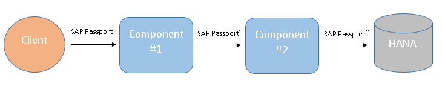

# @sap/e2e-trace

Node.js package with end to end tracing capabilities.


## Overview

### SAP Passport

SAP Passports allow to identify a specific request in an end-to-end scenario involving several components communicating with each other.
This is especially helpful in the task of following the state of a business transaction across different systems.
To achieve that, the client should send a special header ('sap-passport') containing the SAP Passport to the first component.
The SAP Passport is a hex string with a special structure. The client can send one via a browser plugin or via SAPUI5 application frontend.
Whenever an SAP Passport comes into a component, this component should also include the unique identifiers of the SAP Passport in its logs/traces,
update it with component specific data and then forward it to the next system.

See the diagram below:



An application receives an SAP Passport in the 'sap-passport' header. The same header is used when the SAP Passport is getting forwarded over the HTTP protocol to another system.
If it is being sent to HANA, the SAP Passport should be set as the 'SAP_PASSPORT' session variable of the database connection.

#### API

- Loading the package:

```js
var SAPPassport = require('@sap/e2e-trace').Passport;
```

- Creating an SAP Passport instance

```js
function requestHandler(req, res) {
  var encodedPassport = req.headers[SAPPassport.HEADER_NAME];
  if (encodedPassport) {
    var passport = new SAPPassport(encodedPassport);
  }
}
```

The library provides a constant for the 'sap-passport' header: `SAPPassport.HEADER_NAME`.

The `passport` variable is an instance with which you may read/modify the SAP Passport in your component.

- Reading the unique identifiers of an SAP Passport

```js
var identifiers = passport.readUniqueIdentifiers();
```

The returned value (assigned to the `identifiers` variable) is an object that has the following properties: `transactionID`, `rootContextID`, `connectionID`, `connectionCounter`.
These SAP Passport fields got to be present in the logs/traces of the component.
If you are using the `sap-logging` library, refer to its documentation to check whether the specific version is capable of handling SAP Passports or not.


- Updating the SAP Passport - this is done right before forwarding it to the next component.

```js
passport.update({
  previousComponent: 'my-application',
  connectionID: '00112233445566778899AABBCCDDEEFF',
  connectionCounter: 36
});
```

This method takes an object with the following properties:

Property      | Value      | Mandatory | Semantics
------------- | ---------- | --------- | --------------------------
`previousComponent` | ASCII string. Up to 32 characters. | | This is the name of the current component which is about to make an outbound connection to another component. Defaults to _XSA Node.js_.
`connectionID` | GUID, 16-byte hex | yes | Every connection between the current component and the next component should have an ID which is passed as that property.
`connectionCounter`| Positive integer, up to 4 bytes | yes | States for which time the connection with the given `connectionID` is being reused.

- Compacting the SAP Passport - HANA DB has a limitation over the SAP Passport size.
This is why it is recommended to call the method `compact` before forwarding an SAP Passport to HANA.

```js
passport.compact();
```

- Generating a hex string out of the updated SAP Passport - the SAP Passport can be send to other components in this format.

```js
var http = require('http');
var url = require('url');

var encodedPassport = passport.serialize();

var options = url.parse('http://my-host:1234/my/path');
options.headers = {};
options.headers[SAPPassport.HEADER_NAME] = encodedPassport;

var request = http.request(options);
request.on('error', function (err) { /* ... */ });
request.on('response', function (response) { /* ... */ });
request.end();
```


### DSR records

Distributed Statistics Records contain statistical information regarding an incoming request.
The library writes every record on the standard output in a JSON format.
Gathering DSR statistics is triggered when a request containing an SAP passport is received.

#### API

```js
var connect = require('connect');
var createDsrMiddleware = require('@sap/e2e-trace').createDsrMiddleware;

var app = connect();

app.use(createDsrMiddleware());
app.use('/path', function (req, res, next) {
  // ...
});
```

The DSR middleware should be the first middleware in the request processing flow.

Example DSR record:

```json
{"action":"https://host:5555/path?a=1&b=2","receivedBytes":1230,"sentBytes":110,"respTime":18,"transId":"104A7DB661D31EE69DE912281546ED81","userId":"n.a.","startTime":1473506434377}
```

Properties in a DSR record:

Property      | Description
------------- | -----------
startTime     | Time at which request processing starts (milliseconds elapsed since 1 January 1970 00:00:00 UTC).
action        | The requested URL.
receivedBytes | Number of bytes the incoming HTTP request contains (lengths of request line, headers section and body included). **Note**: due to a bug in Node.js, this field might be 0 in some runtime versions. Refer to the `engines/node` property in _package.json_ for recommended Node.js versions.
sentBytes     | Number of bytes the outgoing HTTP response contains (lengths of status line, headers section and body included).
respTime      | Number of milliseconds spent in request processing (until the whole outgoing HTTP response has been handed off to the operating system for transmission over the network).
transId       | The Transaction ID field of the SAP Passport that has triggered the DSR record.
userId        | User ID of the current user taken from the request object. Defaults to `n.a.`.
